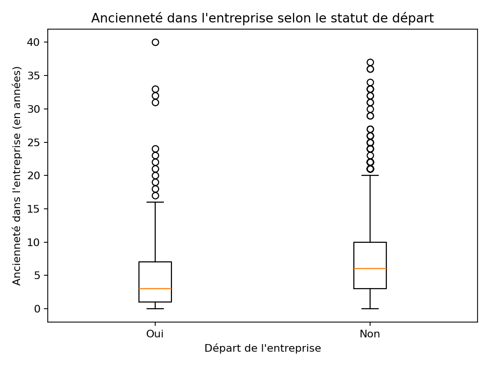

## 🚀 Projets phares

### 1️⃣ People Analytics – Analyse de l’attrition des employés
**Problème métier**  
Taux d’attrition élevé et manque de visibilité sur les facteurs réels de départ des employés, rendant les décisions RH peu ciblées.

**Approche analytique**  
- Analyse exploratoire des données RH (âge, ancienneté, performance, satisfaction)
- Segmentation des profils à risque
- Identification des variables les plus corrélées à l’attrition

**Stack technique**  
Python (Pandas, NumPy, Matplotlib), Jupyter Notebook

**Impact & valeur métier**  
- Mise en évidence de leviers RH actionnables (ancienneté, surcharge de travail, satisfaction)
- Aide à la priorisation des actions de rétention
- Support analytique à la prise de décision stratégique RH
  

---

### 2️⃣ Télécommunications – Analyse de la Qualité de Service (QoS)
**Problème métier**  
Difficulté à évaluer objectivement la performance du réseau et à identifier les zones ou indicateurs critiques impactant l’expérience client.

**Approche analytique**  
- Analyse de KPI réseau (QoS, performance, continuité de service)
- Comparaison des performances par zone et par indicateur
- Synthèse analytique orientée décision

**Stack technique**  
Python, analyse de données, reporting analytique

**Impact & valeur métier**  
- Identification des axes d’amélioration prioritaires du réseau
- Meilleure lisibilité des performances pour les décideurs
- Contribution à l’amélioration de la qualité de service et de la satisfaction client

---

### 3️⃣ Visualisation interactive – Carte MOS
**Problème métier**  
Données techniques difficiles à interpréter rapidement par des profils non techniques.

**Approche analytique**  
- Transformation de données brutes en visualisation interactive
- Mise en place d’une carte géographique dynamique
- Focus sur la lisibilité et l’accessibilité de l’information

**Stack technique**  
HTML, JavaScript, Leaflet

**Impact & valeur métier**  
- Réduction du temps de compréhension des données
- Support visuel à la prise de décision
- Valorisation des données techniques auprès de profils métier
