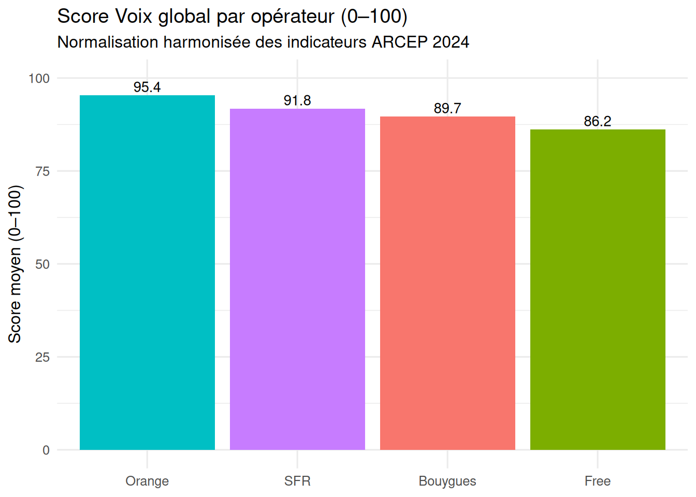

## 🚀 Projets phares

### 1️⃣ People Analytics – Analyse de l’attrition des employés
**Problème métier**  
Taux d’attrition élevé et manque de visibilité sur les facteurs réels de départ des employés, rendant les décisions RH peu ciblées.

**Approche analytique**  
- Analyse exploratoire des données RH (âge, ancienneté, performance, satisfaction)
- Segmentation des profils à risque
- Identification des variables les plus corrélées à l’attrition

**Stack technique**  
Python (Pandas, NumPy, Matplotlib), Jupyter Notebook

**Impact & valeur métier**  
- Mise en évidence de leviers RH actionnables (ancienneté, surcharge de travail, satisfaction)
- Aide à la priorisation des actions de rétention
- Support analytique à la prise de décision stratégique RH
  

---

### 📡 Telecom – Qualité de Service (QoS)

**Problématique**  
Comment synthétiser la qualité de la voix réseau afin de comparer objectivement les performances selon les environnements (urbain, rural, indoor, outdoor) et identifier les zones à risque ?

**Approche analytique**  
Construction d’un **score voix composite (0–100)** à partir de plusieurs KPI réseau (délai d’établissement, taux de réussite des appels, qualité radio, MOS), avec pondération et normalisation des indicateurs.

**Impact métier**  
- Comparaison claire de la performance voix par environnement  
- Identification automatique des environnements à risque  
- Aide à la priorisation des actions d’optimisation réseau

---

### 3️⃣ Visualisation interactive – Carte MOS
**Problème métier**  
Données techniques difficiles à interpréter rapidement par des profils non techniques.

**Approche analytique**  
- Transformation de données brutes en visualisation interactive
- Mise en place d’une carte géographique dynamique
- Focus sur la lisibilité et l’accessibilité de l’information

**Stack technique**  
HTML, JavaScript, Leaflet

**Impact & valeur métier**  
- Réduction du temps de compréhension des données
- Support visuel à la prise de décision
- Valorisation des données techniques auprès de profils métier
