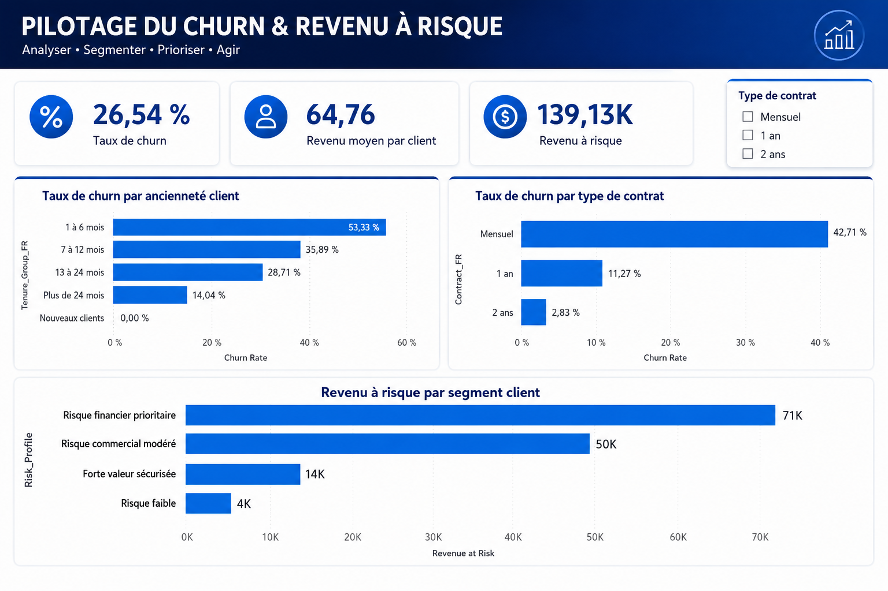

## 🚀 Projets phares

---

### 1️⃣ Télécom – Pilotage du churn & revenu à risque

**Problématique métier**  
Comment identifier les segments clients les plus exposés à la résiliation afin de réduire le churn, protéger le revenu et prioriser les actions de fidélisation ?

**Approche analytique**  
- Analyse du churn selon le type de contrat et l’ancienneté client
- Segmentation des profils à risque
- Estimation du revenu exposé au churn (Revenue at Risk)
- Construction d’un dashboard décisionnel orienté pilotage commercial

**Stack technique**  
SQL, Python, Power BI, Quarto

**Impact & valeur métier**  
- Identification des segments clients les plus critiques
- Priorisation des actions de rétention
- Quantification du revenu à risque
- Support analytique à la prise de décision commerciale

🔎 Voir l’analyse complète :  
https://nancy-jennifer.github.io/telecoms/projet_churn/

---

### 2️⃣ People Analytics – Analyse de l’attrition des employés

**Problématique métier**  
Taux d’attrition élevé et manque de visibilité sur les facteurs réels de départ des employés, rendant les décisions RH peu ciblées.

**Approche analytique**  
- Analyse exploratoire des données RH (âge, ancienneté, performance, satisfaction)
- Segmentation des profils à risque
- Identification des variables les plus corrélées à l’attrition

**Stack technique**  
Python (Pandas, NumPy, Matplotlib), Jupyter Notebook

**Impact & valeur métier**  
- Mise en évidence de leviers RH actionnables
- Aide à la priorisation des actions de rétention
- Support analytique à la prise de décision stratégique RH

🔎 Voir l’analyse complète :  
https://nancy-jennifer.github.io/people-analytics/attrition/

---

### 3️⃣ Télécom – Benchmark QoS France 2024 vs standards internationaux

**Problématique métier**  
Comment positionner la qualité de service mobile face aux standards internationaux afin d’identifier les écarts critiques et orienter les décisions d’investissement réseau ?

**Approche analytique**  
- Benchmark des KPI QoS mobiles
- Comparaison ARCEP / ITU / Banque Mondiale
- Analyse des écarts de performance
- Identification des leviers d’amélioration prioritaires

**Stack technique**  
Python, SQL, Quarto

**Impact & valeur métier**  
- Identification des écarts critiques de performance
- Aide à la priorisation des investissements réseau
- Support aux décisions stratégiques liées à l’expérience client

🔎 Voir l’analyse complète :  
https://nancy-jennifer.github.io/telecoms/projet2_arcep2024.html

---

### 4️⃣ Performance opérationnelle – Optimisation des workflows

**Problématique métier**  
Les organisations exécutent leurs activités à travers des workflows internes (validation, traitement, approbation).  
Lorsque ces processus deviennent inefficients, les retards s’accumulent, les coûts augmentent et la performance globale se dégrade.

**Approche analytique**  
- Analyse des écarts entre temps estimé et temps réel
- Identification des types de tâches générant le plus de retard
- Estimation du coût opérationnel des délais
- Détection des combinaisons Process × Approval Level générant des frictions

**Stack technique**  
DuckDB (SQL analytique), Python, Matplotlib, Quarto

**Impact & valeur métier**  
- Identification des workflows les plus inefficients
- Détection des goulots organisationnels liés aux validations
- Aide à la priorisation des actions d’optimisation opérationnelle

🔎 Voir l’analyse complète :  
https://nancy-jennifer.github.io/operational-performance/workflow-performance/
