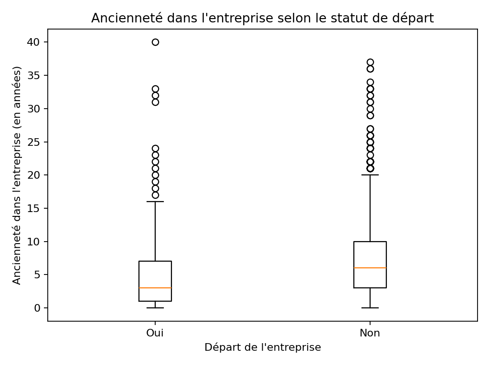
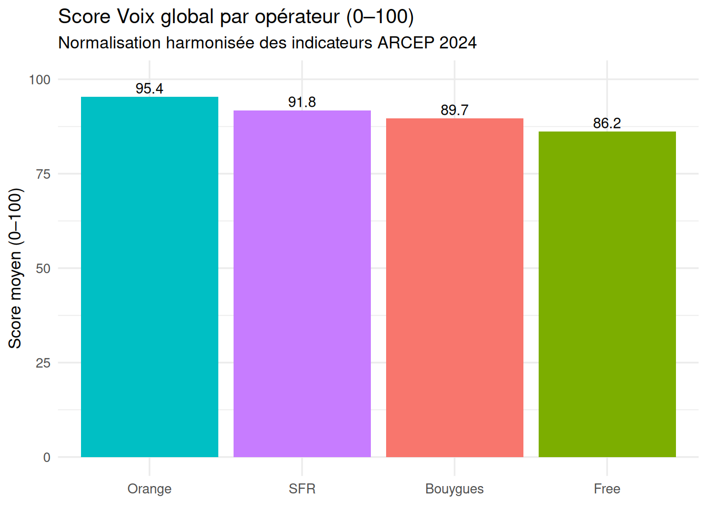
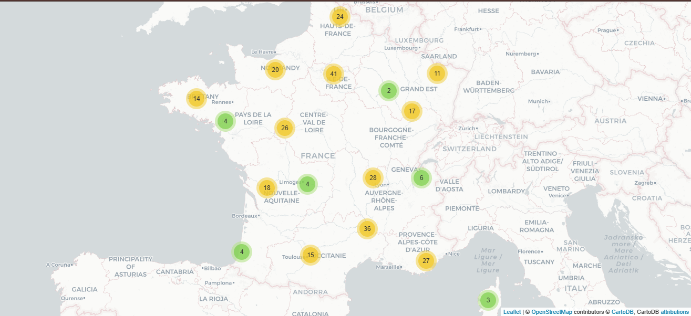
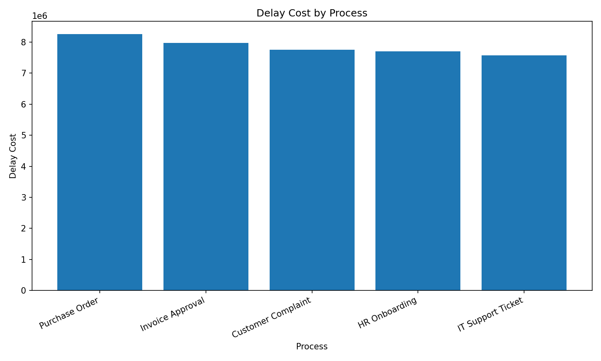

## 🚀 Projets phares

### 1️⃣ People Analytics – Analyse de l’attrition des employés
**Problème métier**  
Taux d’attrition élevé et manque de visibilité sur les facteurs réels de départ des employés, rendant les décisions RH peu ciblées.

**Approche analytique**  
- Analyse exploratoire des données RH (âge, ancienneté, performance, satisfaction)
- Segmentation des profils à risque
- Identification des variables les plus corrélées à l’attrition

**Stack technique**  
Python (Pandas, NumPy, Matplotlib), Jupyter Notebook

**Impact & valeur métier**  
- Mise en évidence de leviers RH actionnables (ancienneté, surcharge de travail, satisfaction)
- Aide à la priorisation des actions de rétention
- Support analytique à la prise de décision stratégique RH
  

🔎 Voir l’analyse complète :
https://nancy-jennifer.github.io/people-analytics/attrition/

---

### 📡 Telecom – Qualité de Service (QoS)

**Problématique**  
Comment synthétiser la qualité de la voix réseau afin de comparer objectivement les performances selon les environnements (urbain, rural, indoor, outdoor) et identifier les zones à risque ?

**Approche analytique**  
Construction d’un **score voix composite (0–100)** à partir de plusieurs KPI réseau (délai d’établissement, taux de réussite des appels, qualité radio, MOS), avec pondération et normalisation des indicateurs.

**Impact métier**  
- Comparaison claire de la performance voix par environnement  
- Identification automatique des environnements à risque  
- Aide à la priorisation des actions d’optimisation réseau

🔎 Voir l’analyse complète :
https://nancy-jennifer.github.io/telecoms/projet2_arcep2024.html

---

### 3️⃣ Visualisation interactive – Carte MOS

*Lecture métier : cette carte met en évidence la distribution géographique des points de mesure MOS voix et permet d’identifier rapidement les zones de performance hétérogène, en particulier sur les axes de transport et en zones peu denses.*

**Problème métier**  
Données techniques difficiles à interpréter rapidement par des profils non techniques.

**Approche analytique**  
- Transformation des données brutes en visualisation interactive
- Carte statique intégrée au README pour un accès immédiat et lisible
- Stack technique : HTML, JavaScript, Leaflet

**Stack technique**  
HTML, JavaScript, Leaflet

**Impact & valeur métier**  
- Réduction du temps de compréhension des données pour les décideurs
- Support visuel pour la prise de décision tout en maintenant la clarté.
- Version interactive complète disponible via le lien, avec possibilité d’explorer les points MOS voix, zoom et popups

[Carte interactive P1 – Visualisation complète](https://nancy-jennifer.github.io/carte-leaflet/carte_leaflet_mos.html)

🔎 Voir l’analyse complète :
https://nancy-jennifer.github.io/telecoms/projet1_arcep2022.html

---

### 3️⃣ Performance opérationnelle – Optimisation des workflows

**Problème métier**

Les organisations exécutent leurs activités à travers des workflows internes (validation, traitement, approbation).  
Lorsque ces processus deviennent inefficients, les retards s’accumulent, les coûts augmentent et la performance globale se dégrade.

**Approche analytique**

- Analyse des écarts entre temps estimé et temps réel
- Identification des types de tâches générant le plus de retard
- Estimation du coût opérationnel des délais
- Détection des combinaisons Process × Approval Level générant des frictions

**Stack technique**

DuckDB (SQL analytique), Python, Matplotlib, Quarto

**Impact & valeur métier**

- Identification des workflows les plus inefficients
- Détection des goulots organisationnels liés aux validations
- Aide à la priorisation des actions d’optimisation opérationnelle

🔎 Voir l’analyse complète :
https://nancy-jennifer.github.io/people-analytics/operational-performance/

